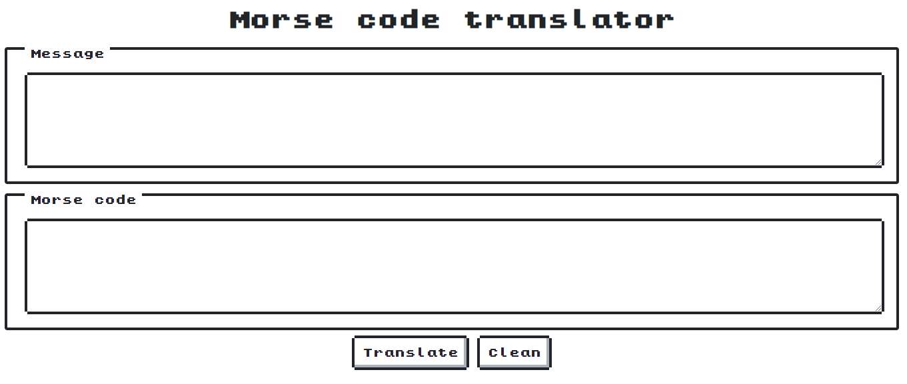

# Morse code translator
A morse code translator in Angular.

## International Morse Code
The translator uses the international morse code (ITU), as showed in the table.

### Letters

| Character | International Code |
|-----------|--------------------|
|A|.-|
|B|-...|
|C|-.-.|
|D|-..|
|E|.|
|F|..-.|
|G|--.|
|H|....|
|I|..|
|J|.---|
|K|-.-|
|L|.-..|
|M|--|
|N|-.|
|O|---|
|P|.--.|
|Q|--.-|
|R|.-.|
|S|...|
|T|-|
|U|..-|
|V|...-|
|W|.--|
|X|-..-|
|Y|-.--|
|Z|--..|

### Numbers

| Number | International Code |
|--------|--------------------|
|1|·----|
|2|··---|
|3|···--|
|4|····-|
|5|·····|
|6|-····|
|7|--···|
|8|---··|
|9|----·|
|0|-----|

### Special Characters

| Special Characters | International Code |
|--------------------|--------------------|
|.|·-·-·-|
|,|--··--|
|?|··--··|
|'|·----·|
|!|-·-·--|
|/|-··-·|
|(|-·--·|
|)|-·--·-|
|&|·-···|
|:|---···|
|;|-·-·-·|
|=|-···-|
|-|-····-|
|_|··--·-|
|"|·-··-·|
|$|···-··-|
|@|·--·-·|